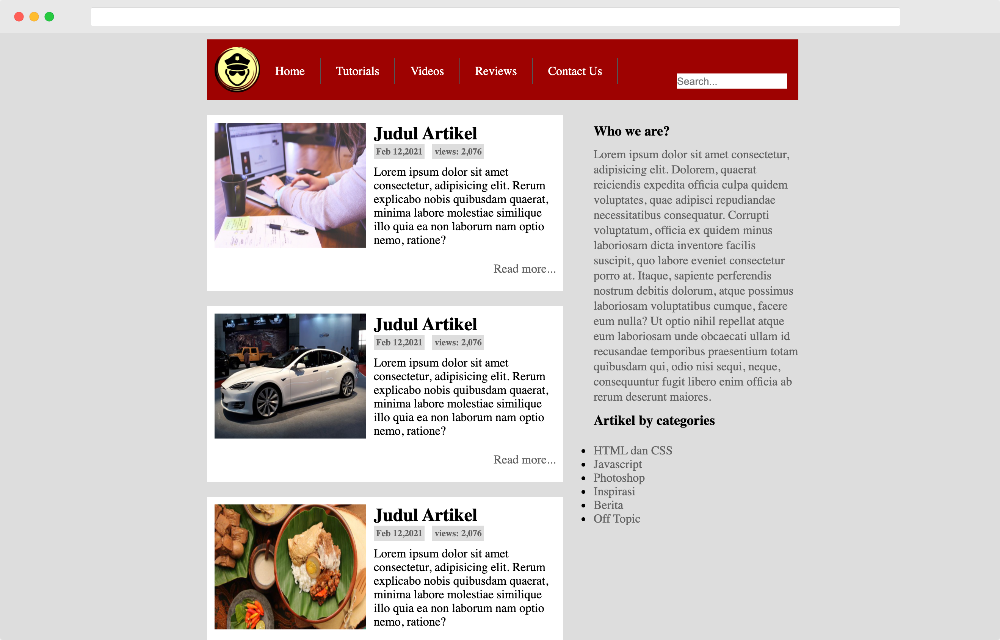
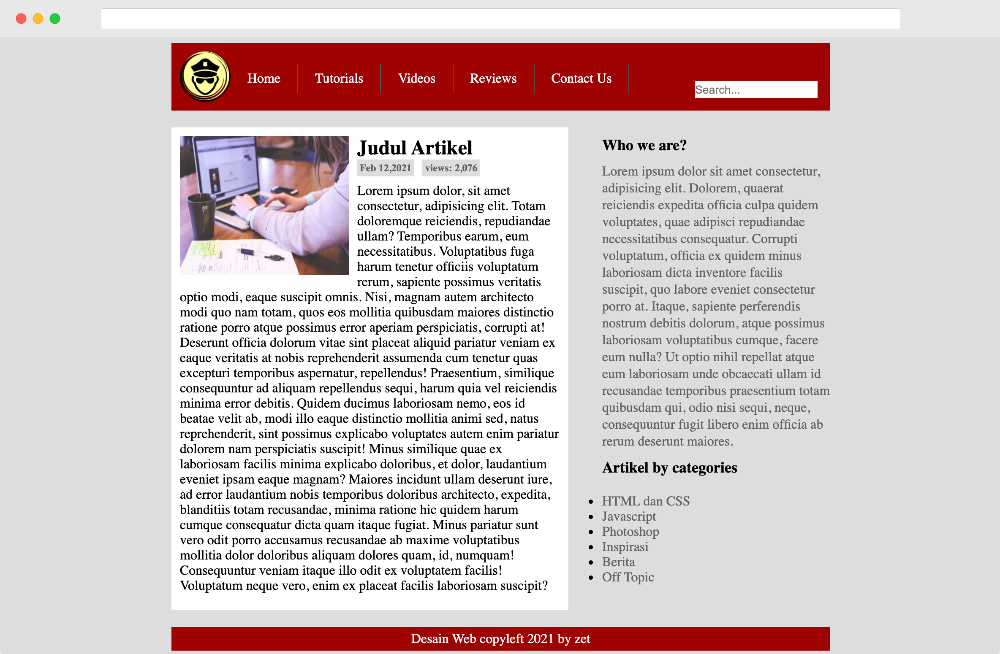
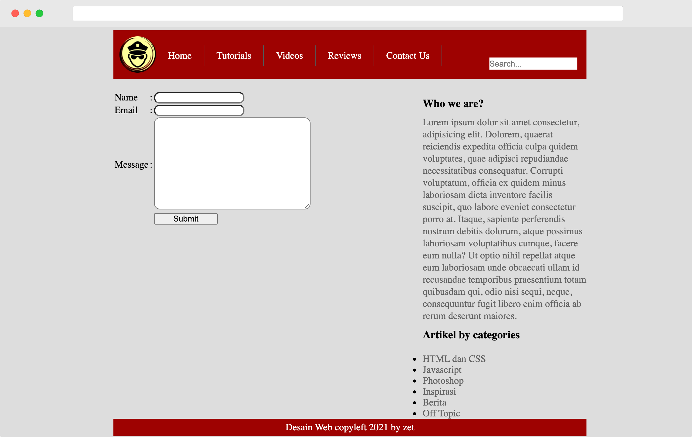

# Tugas 1 - Penilaian Pertama
```
Kerjakan Praktik membuat web template.pdf berikut ini, kemudian tampilkan dibrowser. Selanjutnya ubah menjadi layout semantik seperti pada contoh video. Cek hasil template anda di http://validator.w3.org pastikan bebas dari warning dan error
Total Skor Nilai Tugas 1 : 20
Tugas terdiri dari 4 page :
1. Halaman homepage / index.
2. Halaman artikel [isinya hanya list artikel mirip halaman home]
3. Halaman detail artikel [full artikel jika di klik]
4. Halaman contact us (terdapat form), input typenya bebas
Buat akun github (https://github.com ) jika belum punya, create repository misal webdesain. Push file desain anda ke repository. Bingung? Lihat video dibawah ini, gunakan salah satu cara dari ketiga video berikut :
1. Upload menggunakan github desktop https://www.youtube.com/watch?v=58MSiKL9qhE
2. Upload menggunakan command line https://www.youtube.com/watch?v=WWpyLfKUHVY
3. Upload menggunakan git bash https://www.youtube.com/watch?v=aWyfRdYXXCU

Silahkan modifikasi warna background, font yang sesuai. Untuk mengganti image bisa nyari di https://www.freepik.com/

-----@@@ Nilai A Desain Web Anda Dimulai Dari Tugas 1 Ini, Jangan Sampe ga Ngumpul Yaaa @@@ ------
```
* ### Halaman index dan artikel

* ### Halaman detail artikel

* ### Halaman contact us
